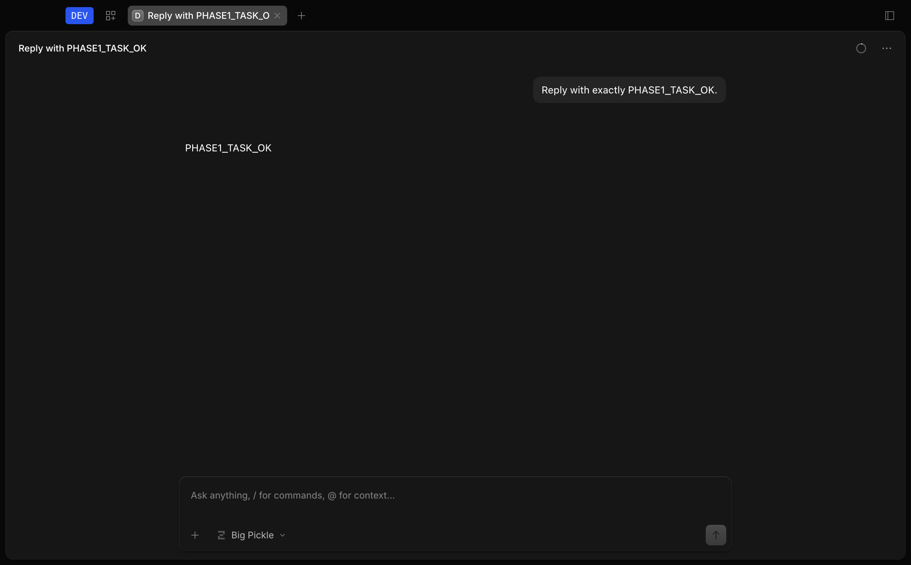

# Phase 1 Verification

## Result

**PASS.** The thin-fork foundation preserves the pinned OpenCode v1.18.10
runtime while adding product-owned task, event, identity, sidecar, and Desktop
host boundaries. The package remains a development artifact and is not approved
for distribution.

## Environment

- Branch: `codex/phase-0-3`
- Host: Apple Silicon macOS 26.3.1 (a)
- Bun: 1.3.14
- Electron: 42.3.3
- OpenCode baseline: `v1.18.10` at `7902e04c3a67f7c69726bc955efb46e29214c797`
- Models.dev snapshot SHA-256: `0935bc2a6a6068e0355a94976211db2d9e7c0198ec3e22866dd996f61b2a8306`

## Automated Gate

All commands ran from the detached worktree `/tmp/ai-agent-phase0-gate` because
new Bun processes cannot reliably traverse the locked workspace path on this
host.

| Area | Command | Result |
| --- | --- | --- |
| Lint | `bun run lint` | PASS; 0 errors |
| App typecheck | `bun run --cwd packages/app typecheck` | PASS |
| Desktop typecheck | `bun run --cwd packages/desktop typecheck` | PASS |
| Product and composer tests | `(cd packages/app && bun test --conditions=solid --preload ./happydom.ts ./src/product ./src/components/prompt-input)` | PASS; 123 tests |
| Desktop tests | `(cd packages/desktop && bun test)` | PASS; 100 tests, 285 assertions |
| Event adapter benchmark | Representative recorded event batch | PASS; 18.14 ms, budget 200 ms |
| Protected runtime | `git diff --exit-code v1.18.10...HEAD -- packages/core packages/opencode packages/server packages/protocol` | PASS; no changes |
| Desktop build | Pinned `MODELS_DEV_API_JSON`, `OPENCODE_CHANNEL=dev bun run --cwd packages/desktop build` | PASS |
| Unsigned package | `electron-builder --mac --dir ... identity=null notarize=false` | PASS; 577 MB app |
| Runtime icon contract | Builder test plus packaged SHA-256 comparison | PASS |

`.github/workflows/product.yml` reproduces lint, type checks, product tests, all
Desktop tests, the protected-runtime check, and a Desktop build on macOS. Its
build uses the checked repository fixture at
`packages/core/test/plugin/fixtures/models-dev.json`, so pull requests do not
depend on the mutable Models.dev API. The local release gate additionally uses
the complete pinned Phase 0 snapshot.

## Packaged Smoke Test

The unsigned arm64 package was launched with `CFFIXED_USER_HOME`, `HOME`, and
all XDG roots pointed at `/tmp/agent-phase1-smoke.hRre9x`. The default project
was initialized as a temporary Git repository. Agent Browser 0.33.1 drove the
packaged Electron renderer through the real composer path.

- Product name: `Agent Desktop Dev`
- Bundle ID and data namespace: `dev.agent.desktop`
- Protocol: `agent-desktop-dev`
- Application data: `$CFFIXED_USER_HOME/Library/Application Support/dev.agent.desktop`
- Credential namespace: `dev.agent.desktop.credentials`
- Credential capability: `macos-keychain`, unavailable in Phase 1, with
  read/write/delete all disabled
- Prompt: `Reply with exactly PHASE1_TASK_OK.`
- Model: `opencode/big-pickle`
- Result: exact `PHASE1_TASK_OK`, displayed completion time 3 seconds

Three final-package launches used the Phase 0 timestamp method. The median stays
inside the Phase 0 20% boundaries, although the margin is small:

| Sample | Sidecar healthy | Renderer ready | Application initialized |
| ---: | ---: | ---: | ---: |
| 1 | 1.299 s | 1.746 s | 1.837 s |
| 2 | 1.183 s | 1.584 s | 1.658 s |
| 3 | 1.063 s | 1.482 s | 1.569 s |
| **Median** | **1.183 s** | **1.584 s** | **1.658 s** |
| **Phase 0 boundary** | **1.192 s** | **1.585 s** | **1.676 s** |

Startup therefore passes Phase 1, but Phase 2 must retain this gate and improve
the margin before adding model-service startup work.

## Recovery Evidence

The V1 sidecar utility process was terminated twice with `SIGTERM`. Each restart
reused the original authenticated loopback URL, and the renderer-visible status
contained no URL, username, password, authorization header, environment value,
or raw error.

Recorded second fault sequence:

```text
ready
restarting (attempt 1, retry scheduled after 250 ms, redacted exit error)
restarting (attempt 1)
ready
```

The transition from detected exit to `ready` took 1.226 seconds. The task and
assistant response remained visible after both automatic recoveries and after a
complete application restart. Graceful application quit stopped the sidecar
with exit code 0 and did not restart it.



The screenshot SHA-256 is
`5335e3bb62198e74e95aaf471957458487f1e996e866adecdf8254a0af8bd59a`.

## Accessibility And Packaging

The first task-screen axe run found an unnamed session-tab close button. The
button now has the same `Close tab` accessible name as the draft-tab action.
The final packaged audit reports 0 violations, 35 passes, and 1 incomplete
color-contrast check affecting four nodes whose effective background could not
be determined automatically.

Packaging also exposed a missing external Dock icon. Runtime icons are now
copied to `Contents/Resources/icons`; packaged and source `dock.png` checksums
match, and the final launch has no missing-icon warning.

Remaining non-blocking upstream build/package warnings include dynamic and
static imports sharing chunks, generated server `eval` warnings, missing package
description, absent optional dependencies for other architectures, and the
absent optional Desktop native directory. Signing, notarization, complete third-
party notices, and the four unresolved license declarations remain distribution
blockers from Phase 0.

## Phase 2 Dependencies

Phase 2 must implement macOS Keychain read/write/delete behind the existing
credential host API without adding secret-bearing lifecycle payloads. It must
also add product-owned visual model profiles, connection testing, Ollama and LM
Studio discovery, provider/model validation, and settings persistence. Windows
must keep the same host contract and use Windows Credential Manager when that
platform implementation begins.

The startup median must be remeasured after those services are present and
brought back within the Phase 0 regression budget before Phase 3 UI work is
declared complete.

## Review Outcome

The specification review is **APPROVED**: every Phase 1 task and gate maps to
committed code, tests, CI, or recorded runtime evidence; the four protected
OpenCode runtime packages remain unchanged.

The quality review is **APPROVED after fixes**. It found and resolved three
issues: runtime icons were missing outside `app.asar`, the created-session tab
close button lacked an accessible name, and a failed preload sidecar
subscription could not recover. The reviewed package was rebuilt and rechecked
after all three fixes.

External reviewer workers were unavailable because the environment's agent
quota was exhausted. The approvals above come from two separate local review
passes backed by static checks, contract tests, a packaged smoke test, and axe;
no external-model approval is claimed.
