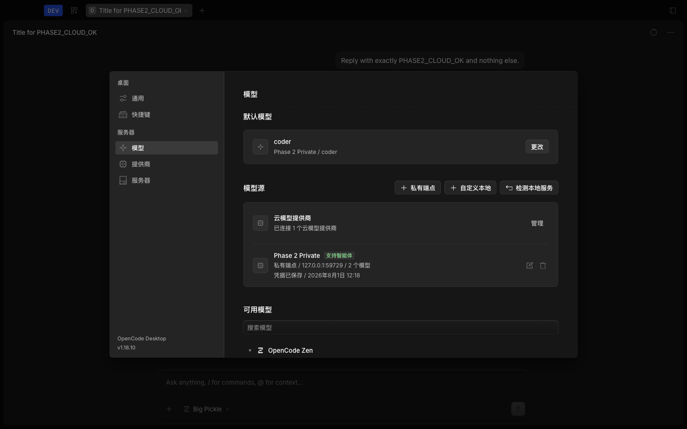
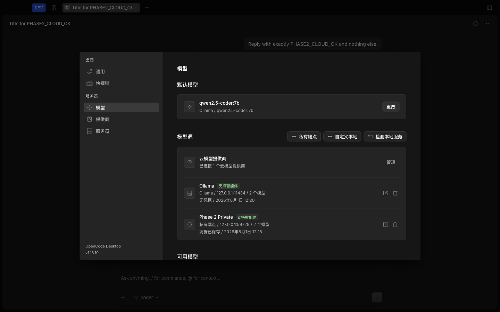

# Phase 2 Visual Model Center Verification

## Result

**PASS.** The packaged macOS arm64 development app preserves cloud-provider
execution and adds visual private and local provider profiles, behavioral model
tests, macOS Keychain-backed credentials, local service discovery, persistent
default selection, and credential-safe deletion without changing the protected
OpenCode runtime packages.

This is an unsigned development artifact. It is not approved for distribution.
Windows credential storage and task crash recovery remain later-phase work.

## Environment

- Date: 2026-08-01
- Host: Apple Silicon, macOS 26.3.1 (a), build 25D771280a
- Branch: `codex/phase-0-3`
- Pinned upstream: OpenCode v1.18.10
- Bun: 1.3.14
- Electron: 42.3.3
- Agent Browser: 0.33.1
- Package identity: `dev.agent.desktop`, `Agent Desktop Dev`, version 1.18.10
- Acceptance root: `/tmp/agent-phase2-final.uJar73`

The package used isolated Electron `--user-data-dir` and isolated XDG config,
data, cache, and state roots. `HOME` and `CFFIXED_USER_HOME` remained the real
login user because macOS `safeStorage` must exercise the login Keychain; an
isolated `CFFIXED_USER_HOME` deadlocked the Security framework and would not be
a representative credential test. The new user-data resolver proves the
standard Electron override is honored.

## Automated Gate

| Gate | Result | Evidence |
| --- | --- | --- |
| App unit tests | PASS | 791 pass, 0 fail, 2,001 assertions |
| Desktop tests | PASS | 144 pass, 0 fail, 448 assertions |
| App typecheck | PASS | Exit 0 |
| Desktop typecheck | PASS | Exit 0 |
| Lint | PASS | 0 errors; 4,851 repository warnings; no warnings in the new proxy/environment files |
| Desktop build | PASS | Pinned models.dev snapshot and dev channel |
| Unsigned macOS package | PASS | arm64 app, ZIP, and DMG generated |
| Protected runtime diff | PASS | No changes under Core, OpenCode, Server, or Protocol |
| CI coverage | PASS | Product workflow now runs the full App unit suite plus Desktop tests and typechecks |

Focused coverage includes contract validation, profile migration, encrypted
credential CRUD, local detection, redacted diagnostics, capability
classification, IPC allow-listing, config orchestration, sidecar environment
handling, credential proxy authentication and forwarding, user-data override,
and end-to-end secret-boundary scans.

## Packaged Acceptance

### Cloud

The inherited OpenCode provider flow remained visible. A packaged task using
`opencode/big-pickle` and the prompt `Reply with exactly PHASE2_CLOUD_OK and
nothing else.` returned exact `PHASE2_CLOUD_OK`.

### Private OpenAI-Compatible

A deterministic authenticated fixture at `127.0.0.1:59729` was configured only
through the visual flow. The app discovered `coder` and `reasoner`, classified
`coder` as agent-capable after chat, streaming, and tool checks, saved the
profile, retested it after save, and selected it as default. A packaged task
manually selecting `coder` reached the fixture and returned `OK`.

The final hardened package was also tested against an API-Key-only fixture at
`127.0.0.1:59730`, with no sensitive custom header. It discovered and tested
`api-only-coder`, saved the profile, executed a task returning `OK`, restarted
the complete app with a fresh proxy token, and executed a second task returning
`OK`. This closes the common API-Key-only path that the first combined-key/header
fixture did not isolate.

The private profile save, including the supervised sidecar credential reload,
completed in 3.06 seconds. Deterministic fixture discovery and capability
responses rendered without a perceptible remote-network delay; no production
endpoint latency claim is made from this local fixture.

### Local Provider

A deterministic unauthenticated Ollama-compatible fixture occupied the standard
loopback endpoint `127.0.0.1:11434`. The visual detector reported Ollama with two
models and LM Studio as unavailable. The app selected `qwen2.5-coder:7b`, passed
chat, streaming, and tool checks, saved and retested the profile, and selected it
as default. A packaged task manually selecting that model returned `OK`.

No user-installed Ollama or LM Studio service was claimed. The canonical
loopback fixture exercised the same detector, profile, config, and task path.

### Restart And Delete

After a complete app restart, both profiles, both capability reports, and the
Ollama default persisted. The API-key field was empty and the sensitive-header
field exposed only a saved-value placeholder. Deleting the private profile:

- removed it from `agent.model-profiles`;
- reduced `agent.credentials` to an empty object;
- added its provider ID to `disabled_providers`;
- retained Ollama as the valid default.

## Credential Boundary

Credentialed profiles use a main-process loopback proxy. Persisted OpenCode
config receives only environment variable names for the current proxy URL and a
random per-launch proxy token. The proxy authenticates the sidecar request, reads the encrypted
envelope in the main process, injects the real API key and sensitive headers only
on the upstream request, and streams the response back.

If the previously used proxy port is occupied, the proxy binds a fresh port and
the sidecar receives its current URL through the child environment. The config
does not retain a stale port. If the proxy cannot publish runtime values, the
environment builder fails closed and never falls back to real-secret injection.

Before deletion:

- `agent.credentials` contained only base64 ciphertext;
- `agent.model-profiles` contained credential references, presence flags, and
  the sensitive header name, but no value;
- `opencode.jsonc` contained only proxy URL and token environment variable
  names, but no port, API key, sensitive header name, or sensitive header value;
- renderer reads and edit forms returned no secret value.

A binary scan for the API-key and sensitive-header canaries covered the entire
fresh root, including Chromium cache, SQLite files, app logs, renderer logs, and
all `network.netlog` files. It returned zero matches before and after profile
deletion.

## Performance

Three launches of the final packaged app used the Phase 0 main-log timestamp
method: `app starting`, `loading task finished`, `server ready`, and first-launch
onboarding state resolved.

| Sample | Sidecar healthy | Renderer ready | Application initialized |
| ---: | ---: | ---: | ---: |
| 1 | 1.040 s | 1.376 s | 1.445 s |
| 2 | 1.026 s | 1.361 s | 1.428 s |
| 3 | 1.017 s | 1.363 s | 1.431 s |
| **Median** | **1.026 s** | **1.363 s** | **1.431 s** |
| **Phase 0 boundary** | **1.192 s** | **1.585 s** | **1.676 s** |

All three medians pass the 20% regression boundaries.

## Visual And Accessibility

The model center was inspected at 1440x900 and 1024x768, and the profile editor
at a 720x800 renderer viewport. The 720px body width matched its scroll width,
both nested dialogs remained inside the viewport, and screenshots showed no
overlap, horizontal clipping, layout shift, nested-card misuse, or untranslated
Phase 2 copy.

| Surface | Axe passes | Violations | Incomplete |
| --- | ---: | ---: | --- |
| Models settings | 36 | 0 | `aria-hidden-focus`, `color-contrast` |
| Profile editor with advanced fields | 33 | 0 | `aria-hidden-focus`, `color-contrast` |

An actual `3.93:1` contrast violation on the sensitive-header switch label was
fixed and the final package was rebuilt. The two remaining items are incomplete
automated checks: focus retained behind nested modal `aria-hidden` handling, and
contrast that axe cannot determine across gradient/overlap backgrounds. They are
not reported violations; the existing modal focus warning remains Phase 3 UI
work.

## Artifact Hashes

| Artifact | SHA-256 |
| --- | --- |
| `app.asar` | `a97b010bad3f8da0857fe2a4b986f2d28bac6d6d01d9f9ec981f7bf843205ef5` |
| `agent-desktop-dev-mac-arm64.zip` | `32e013ade5d19e693807aa8f6c873f8883831d9b417ecd127dc6088e1896877a` |
| `agent-desktop-dev-mac-arm64.dmg` | `5ee9fd2afd22dfa0524c6b935452fddcb9c492cdc3e5f552be30b0da9f897487` |
| `model-center-private.png` | `0bbb712c1e8667bc27d69d000cd1915d1f74b8ed9bab0b71614254f615c9357b` |
| `model-center-local.png` | `1242bcc474ce1ed819a27149369f5b43c1d2fc55029391b6f1952637a1a21032` |

## Gate Decision

Phase 2 is approved for Phase 3 development. Distribution signing,
notarization, Windows credential storage, per-profile proxy and insecure-TLS
controls, and task crash recovery are explicitly outside this gate.
