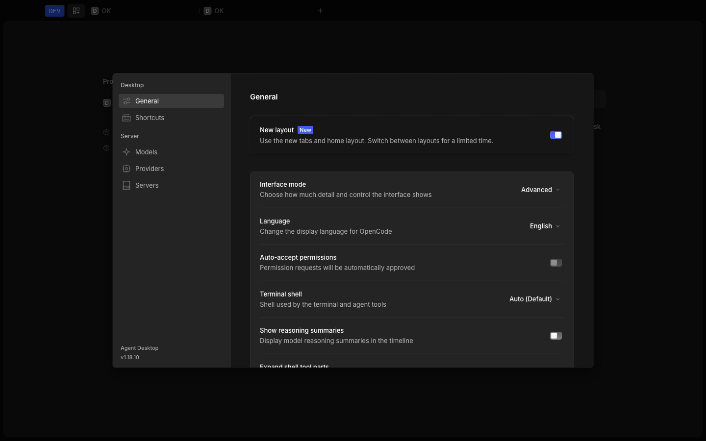

# Phase 3 Verification

## Result

**PASS.** The fresh macOS arm64 development candidate completed the Task 8
source, package, workflow, durable task-management, recovery, accessibility,
visual, startup, isolation, and secret gates. It is an unsigned development
artifact with only an adhoc linker signature. Signing, notarization, and
distribution readiness are not claimed.

## Environment

- Acceptance date: 2026-08-06.
- Source: `codex/phase-0-3` at product-source commit
  `0a5285184bab6916f289b7acf6ad988ed7a52cba`.
- Host: Apple Silicon macOS 26.3.1 (a), Asia/Shanghai.
- Runtime: Bun 1.3.14 and Electron 42.3.3.
- Fresh authoritative root: `/tmp/agent-phase3-final.saJRUu`.
- Build inputs: `OPENCODE_CHANNEL=dev` and the pinned
  `packages/core/test/plugin/fixtures/models-dev.json` model snapshot.
- Packaged workflow roots: fresh Electron `user-data`, XDG
  config/data/cache/state, and temporary directories under the authoritative
  root. The development bundle identifier is `dev.agent.desktop`.

`source-state.txt`, `environment.txt`, and `gate-logs/source-checks.log` retain
the exact source and environment. A fresh migration-complete sentinel prevented
profile import; onboarding completed without creating or importing a project.

## Automated Gates

| Gate                       | Exact result                                                         |
| -------------------------- | -------------------------------------------------------------------- |
| Frozen install             | Bun 1.3.14; 2,419 installs across 2,710 packages; exit 0, no changes |
| App discovery              | 860 passed, 0 failed, 2,207 assertions across 125 files              |
| App scripted unit          | 860 passed, 0 failed, 2,207 assertions across 125 files              |
| App browser                | 39 passed, 0 failed, 96 assertions across 14 files                   |
| App scripted total         | 899 passed, 0 failed, 2,303 assertions                               |
| Focused Task 8 browser E2E | 11 passed, 0 failed across 4 specs                                   |
| App typecheck              | Passed                                                               |
| App E2E typecheck          | Passed                                                               |
| Desktop                    | 149 passed, 0 failed, 462 assertions across 32 files; typecheck pass |
| UI focused                 | 8 passed, 0 failed, 16 assertions in 1 file; typecheck pass          |
| Root lint                  | 4,872 warnings, 0 errors; 3,189 files and 130 rules                  |
| Protected diff             | No Core, OpenCode, Server, or Protocol changes from `v1.18.10`       |
| Tracked diff check         | `git diff --check` passed                                            |

The focused E2E command ran
`home-task-terminology.spec.ts`, `new-session-presentation.spec.ts`,
`session-timeline-accessibility.spec.ts`, and `presentation-mode.spec.ts` with
one worker. Playwright reports tests/specs rather than an assertion total for
this command. `gate-logs/app-accessibility-e2e.log` retains all 11 test names.

`gate-logs/frozen-install.log` retains the prescribed root
`bun install --frozen-lockfile` command, Bun version, stdout/stderr, exit code,
before/after status, and unchanged lockfile SHA-256
`e3c51b315182eb68ca7865351675a05d55d86c2a792462adb510999cc47d6185`.
Only the user-owned untracked `.superpowers/` directory appeared before and
after; the install changed neither it nor tracked files.

The first build invocation encountered a transient `ECONNRESET` while fetching
models.dev data. The final exact build used the pinned repository fixture and
passed, followed by a successful package. Retained non-blocking warnings cover
Node's `module.register()` deprecation, upstream `eval`, Vite import/chunk and
static-script notices, a missing package description, absent optional
other-platform dependencies, and the absent optional Desktop `native`
directory. Electron Builder found no valid signing identity. The final bundle
reports `Signature=adhoc`, no Team ID, and no sealed resources in
`gate-logs/signature.log`.

## Packaged Workflows

### Model Setup

The fresh package opened in Simple mode with no migration or imported profile.
Through Settings > Models, acceptance visually configured authenticated private
profile **Phase 3 Final Private** at `127.0.0.1:59739`, entered API-key and
sensitive-header fixture canaries, marked the header sensitive, discovered its
deterministic models, passed chat/streaming/tool capability checks, saved the
profile, and selected `coder` as default. Product credential storage encrypted
the sensitive values; renderer-visible state retained only non-secret metadata.

Settings > Models also exercised Ollama discovery at `127.0.0.1:11434` and
found two deterministic models. Three real composer submissions reached the
private fixture, streamed, and returned `OK`.

### Mode And State Continuity

Before switching modes, acceptance opened Review with one changed file,
Context > Open File with `README.md`, two Terminal tabs, the model selector,
the Build/Plan agent selector, and Settings > General permission controls. The
Simple-to-Advanced switch preserved the active task, three durable task tabs,
nonempty draft `PRESERVE_DRAFT_ACROSS_MODE`, selected `coder`, review/context,
and terminal state.

After archive/search/resume, a complete process termination and relaunch of the
same exact package preserved Advanced mode, `coder`, active task
`ses_02ad72d04ffePT7DFLAZ3VRctv`, two durable tabs, and the `OK` history. The
later visual-matrix steps intentionally changed mode and locale after this
continuity proof.

### Task Management

`gate-logs/task-management-acceptance.log` is the timestamped, redacted
agent-browser transcript. It proves three real durable submissions, UI archive,
Home search, opening/resuming a search result, and complete process relaunch.
The final checkpointed `task-management-db.txt` records:

| Session ID                       | Created UTC         | Archived UTC        | State    | Messages |
| -------------------------------- | ------------------- | ------------------- | -------- | -------: |
| `ses_02ad94856ffebLRCsyvFvkMmte` | 2026-08-06 03:38:32 | 2026-08-06 03:48:05 | archived |        2 |
| `ses_02ad72d04ffePT7DFLAZ3VRctv` | 2026-08-06 03:40:50 | -                   | active   |        2 |
| `ses_02ad6d254ffeJi2nyXBBOGfUjA` | 2026-08-06 03:41:13 | -                   | active   |        2 |

Logical totals are exactly **3 total, 2 active, 1 archived**, with two messages
per session. After all workflow processes stopped,
`PRAGMA wal_checkpoint(TRUNCATE)` returned `0|0|0` and
`PRAGMA integrity_check` returned `ok`. The final main database is 278,528
bytes with SHA-256
`da8fbd798a1ebf9e36ddc02cb60046b30cb36a7a76eb7b791ae5f2a870f81557`.
The WAL is zero bytes; the retained 32,768-byte SHM index is explicitly hashed
in the dump and has no pending database pages.

### Technical Surfaces And Permissions

Review, Context/Open File, multi-tab Terminal, model and agent selectors, and
General permission controls were all exercised through the packaged UI. Simple
keeps core task actions compact; Advanced exposes the existing detailed
controls. This acceptance preserves agent, MCP, and skill runtime/selector
surfaces but does not claim dedicated visual CRUD for them.

## Recovery And Export

Fault acceptance launched the byte-identical app copy under `package-copy/`,
temporarily made its already-loaded `app.asar` unavailable, and terminated the
generated sidecar utility. `gate-logs/fault-launch.console.log` records start
attempts 1, 2, 3, and 4, followed by bounded exhaustion and the sanitized
failure banner. The failure surface passed axe with 39 passes, 0 violations,
and 1 incomplete color-contrast check.

The visible **Export diagnostics** action produced
`diagnostics/opencode-debug-20260806T040116.zip` with SHA-256
`ddff91f4562716ce125dd7daae52a4286f7eadad64017ed0b7d1988b9c2200d0`.
After restoring exact `app.asar` and CLI hashes, the visible **Restart service**
action returned to ready; the failure banner disappeared and both active task
tabs remained available.

## Startup Performance

The retained method measures from `app starting` to `loading task finished`
(sidecar healthy), `server ready` (renderer requested initialization), and the
onboarding check (application initialized). Every sample used a fresh isolated
user-data/XDG root.

| Sample                   | App start    | Sidecar healthy | Renderer ready | Initialized |
| ------------------------ | ------------ | --------------: | -------------: | ----------: |
| 1                        | 12:04:16.125 |         1.027 s |        1.461 s |     1.567 s |
| 2                        | 12:04:18.289 |         1.013 s |        1.462 s |     1.560 s |
| 3                        | 12:04:20.513 |         1.021 s |        1.468 s |     1.570 s |
| **Median**               |              |     **1.021 s** |    **1.462 s** | **1.567 s** |
| **Phase 0 20% boundary** |              |     **1.192 s** |    **1.585 s** | **1.676 s** |

All three medians pass. Raw logs are `gate-logs/perf-1.console.log` through
`perf-3.console.log`; `performance-summary.txt` retains timestamps,
calculations, boundaries, and the result.

## Visual Matrix

All 12 exact-candidate screenshots are retained under `visuals/` for English
and Simplified Chinese, Simple and Advanced, and 1440x900, 1024x768, and
720x800. Settings > General visibly shows the selected mode and language.

| Locale | Mode     | Viewport | Retained screenshot                   | SHA-256                                                            |
| ------ | -------- | -------- | ------------------------------------- | ------------------------------------------------------------------ |
| EN     | Simple   | 1440x900 | `visuals/en-simple-1440x900.png`      | `e67725bc11df5a0551504ee9591d8e881ec3b1d9cf0b421294e61c94249b9929` |
| EN     | Simple   | 1024x768 | `visuals/en-simple-1024x768.png`      | `bb209f0dfd0116f6d130f046b91add45a03cec961caa4a471c6f646532e9be38` |
| EN     | Simple   | 720x800  | `visuals/en-simple-720x800.png`       | `74063a08ec827683482b443a85c680885d3537f9507999329222cc135370834a` |
| EN     | Advanced | 1440x900 | `visuals/en-advanced-1440x900.png`    | `2372eb6a2d1d2939cb114e061873fb572d5ba8a39a04b58fa9d8aa5986f5ea39` |
| EN     | Advanced | 1024x768 | `visuals/en-advanced-1024x768.png`    | `85cb76889248bc04ea401ea2101985b041104c35b12985f3648f514b0063c5b3` |
| EN     | Advanced | 720x800  | `visuals/en-advanced-720x800.png`     | `5037943c1c94e9773a65e862d77089f41b36cf54e85f8647767fbb9973c7677e` |
| zh-CN  | Simple   | 1440x900 | `visuals/zh-CN-simple-1440x900.png`   | `c06693e55d80f07093502761f6f4b671f009a4a02a742b4a5c6ed550539b79cb` |
| zh-CN  | Simple   | 1024x768 | `visuals/zh-CN-simple-1024x768.png`   | `67726dd53e9c46eb9896b5a467d0970d840962d1d1559994af8f91278a9e4bda` |
| zh-CN  | Simple   | 720x800  | `visuals/zh-CN-simple-720x800.png`    | `4096ce357db5b673021d13a4e5d27c8af8e228c0f9ac7b05487538f56c4c3391` |
| zh-CN  | Advanced | 1440x900 | `visuals/zh-CN-advanced-1440x900.png` | `0460949c9913b4ded6b1653497c78bddf5008c92b737a371f7e82d1b488d12ad` |
| zh-CN  | Advanced | 1024x768 | `visuals/zh-CN-advanced-1024x768.png` | `0efc6df8dc0cd807a466173b5561947aa8c81890705692325f1cdd3380f305d5` |
| zh-CN  | Advanced | 720x800  | `visuals/zh-CN-advanced-720x800.png`  | `34e59c0d71152897e99b168e62212eaadbdff6bd453129c35f727842e507b1dc` |

`visuals/visual-matrix-manifest.json` records candidate hashes, screenshot
hashes/dimensions, exact locale/mode, body/root dimensions, renderer fill,
overflow, dialog/control bounds, overlap, frame settling, and nonblank checks.
All 12 pass. At 720x800, the body and root are exactly 720x800; the dark area
around the settings dialog is the dimmed in-app workspace, not capture outside
the visible renderer or a blank document region.

The documentation artifacts are visibly identified exact-candidate English
1440x900 General settings states:

## Accessibility

| Axe surface            |  Passes | Violations | Incomplete | Inapplicable |
| ---------------------- | ------: | ---------: | ---------: | -----------: |
| Home, Simple           |      39 |          0 |          1 |           50 |
| New Task, Simple       |      35 |          0 |          1 |           54 |
| Active Task, Simple    |      35 |          0 |          1 |           54 |
| General, Simple        |      38 |          0 |          2 |           51 |
| Home, Advanced         |      39 |          0 |          1 |           50 |
| New Task, Advanced     |      35 |          0 |          1 |           54 |
| Active Task, Advanced  |      35 |          0 |          1 |           54 |
| General, Advanced      |      38 |          0 |          2 |           51 |
| Models settings        |      36 |          0 |          2 |           53 |
| Sidecar failure banner |      39 |          0 |          1 |           50 |
| **Total**              | **369** |      **0** |     **13** |      **521** |

All 10 retained surface result files report success and zero violations;
`axe-summary.json` contains their aggregate. The 13 incompletes are axe
uncertainty, not violations: layered/short-content `color-contrast`, plus one
existing modal `aria-hidden-focus` uncertainty on each General and Models
surface. Packaged checks also recorded exactly one level-one heading on Home and
Active Task, and a labeled Home combobox with `aria-controls`, correct expanded
state, a listbox, and two search options.

## Security And Isolation

`gate-logs/security-scan.log` retains the binary-safe fixed-string method,
hashes for both canary classes without their values, package hashes, extraction
and mount locations, file counts, and every result. Its 24 scope/class scans
cover both canary classes across the complete acceptance root, fresh user data,
fresh XDG roots, Chromium caches/databases/network state, Desktop/sidecar logs
and netlogs, extracted diagnostics, source app bundle, raw ZIP, raw DMG,
extracted ZIP, byte-identical app copy, and read-only mounted DMG.

All 24 observations found zero plaintext match files. `secret-scan.txt` records
`PLAINTEXT_MATCH_FILES=0`, `DMG_PLAINTEXT_MATCH_FILES=0`, and `FINAL_RESULT=PASS`.
The DMG was detached. Every packaged launch used the development identity and
explicit fresh roots; no release-profile path was configured or written by the
acceptance commands.

## Artifact Hashes

| Artifact                          | Size / dimensions | SHA-256                                                            |
| --------------------------------- | ----------------- | ------------------------------------------------------------------ |
| `app.asar`                        | 159,931,457 bytes | `93b0b52415c41103068ba160225bd5d50335a411016cb3219d2e54139717b031` |
| `agent-desktop-dev-mac-arm64.zip` | 215,279,981 bytes | `f961f47270f686290e4b87d37f4619e2319064e1b14092412a7801443a77d80f` |
| `agent-desktop-dev-mac-arm64.dmg` | 216,207,372 bytes | `bb9d1b23dcb978cd0c450ea7aeba814a569d5cde7de8c85db7685458d2ff3b58` |
| Packaged `opencode-cli`           | 144,371,024 bytes | `97d65671c27949869e4d3e9e90b596d9b9b81cd00ca7b3d602d409a06c83612e` |
| `task-workspace-simple.png`       | 1440x900          | `e67725bc11df5a0551504ee9591d8e881ec3b1d9cf0b421294e61c94249b9929` |
| `task-workspace-advanced.png`     | 1440x900          | `2372eb6a2d1d2939cb114e061873fb572d5ba8a39a04b58fa9d8aa5986f5ea39` |

`artifact-hashes.txt` and `cli-hashes.txt` are the authoritative package
records. The source bundle and byte-identical fault copy match after recovery.

## Deferred Risks

- Windows Credential Manager/backend and Windows packaging were not exercised
  and are not claimed.
- SSH remains a reserved server type, not an implemented or verified feature.
- macOS signing and notarization were not performed; distribution license and
  notice review and distribution readiness remain deferred.
- Durable in-flight execution recovery after a process crash remains deferred;
  this gate covers persisted task/UI continuity and supervised sidecar recovery.
- Dedicated visual CRUD/managers for agents, MCP servers, and skills remain
  deferred. Delivered MCP coverage is the preserved status, toggle, resource,
  prompt, OAuth, and command surfaces.
- Axe color-contrast and modal aria-hidden-focus incompletes require manual
  review; they are not automated violations.

## Gate Decision

**GO for Phase 3 development acceptance on this exact unsigned/adhoc macOS
arm64 candidate.** This decision does not imply Windows support, SSH support,
signing, notarization, distribution licensing, or distribution readiness.
